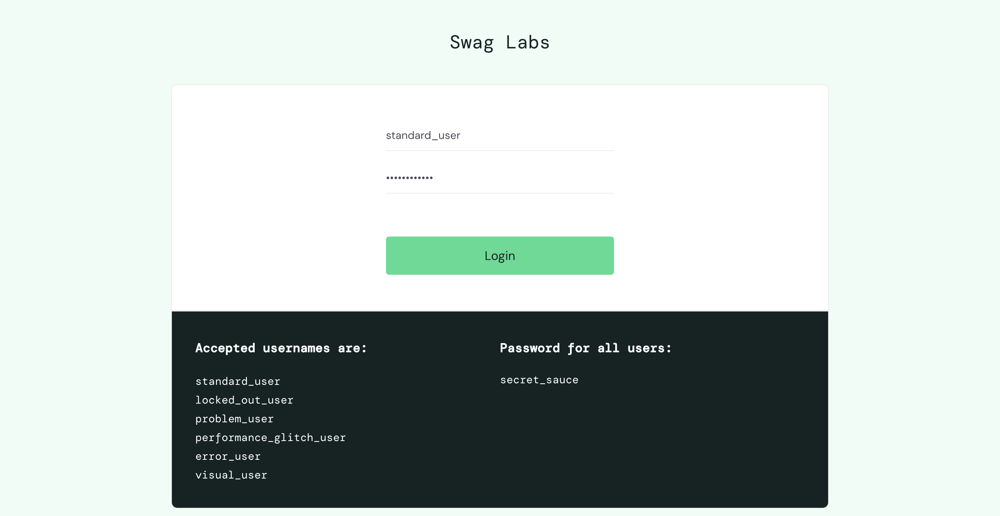
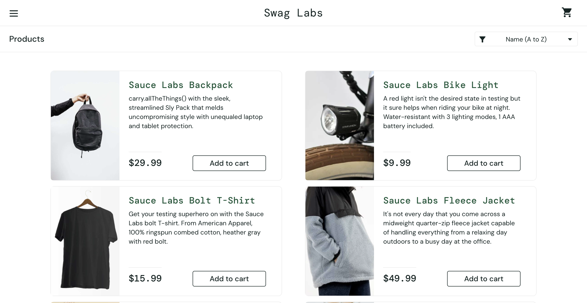

# Automation Framework 2026

A production-ready **Selenium + Pytest** test automation framework built with the **Page Object Model (POM)** design pattern. It features config-driven locators, automatic driver management with manual fallback support, structured logging, and multi-browser compatibility.

The framework is designed for scalability and maintainability — adding new pages, locators, and tests requires minimal boilerplate.

---

## Table of Contents

- [Screenshots](#screenshots)
- [Architecture Overview](#architecture-overview)
- [Project Structure](#project-structure)
- [Prerequisites](#prerequisites)
- [Installation](#installation)
- [Running Tests](#running-tests)
- [Configuration](#configuration)
- [Driver Management](#driver-management)
- [Page Object Model](#page-object-model)
- [Adding New Tests](#adding-new-tests)
- [Logging](#logging)
- [Supported Browsers](#supported-browsers)
- [Troubleshooting](#troubleshooting)
- [Contributing](#contributing)
- [License](#license)

---

## Screenshots

### Login Page
The framework navigates to the target application and interacts with the login form.


### Entering Credentials
Credentials are typed into the username and password fields using config-driven locators.



### Successful Login — Inventory Page
After login, the framework asserts that the user has landed on the inventory page by verifying the "Products" title.



### Test Execution — Terminal Output

```
============================= test session starts ==============================
platform darwin -- Python 3.13.0, pytest-8.3.5, pluggy-1.5.0
rootdir: /Users/kaizen/Desktop/Automation_Framework_2026
collecting ... collected 1 item

tests/test_loginAsStandardUser.py::test_verify_login_as_standard_user PASSED [100%]

============================== 1 passed in 5.79s ==============================
```

---

## Architecture Overview

```
                          +-----------------+
                          |   pytest runner  |
                          +--------+--------+
                                   |
                          +--------v--------+
                          |   conftest.py   |
                          |  (fixtures &    |
                          |  driver setup)  |
                          +--------+--------+
                                   |
                    +--------------+--------------+
                    |                             |
           +--------v--------+          +--------v--------+
           |   Test Files    |          |  config.ini     |
           | (test_*.py)     |          | (locators, URL, |
           +--------+--------+          |  browser)       |
                    |                   +--------+--------+
           +--------v--------+                   |
           |   Page Objects  |<------------------+
           | (LoginPage,etc) |    reads locators
           +--------+--------+
                    |
           +--------v--------+
           |   WebActions    |
           | (BasePage)      |
           | 40+ methods:    |
           | clicks, typing, |
           | waits, dropdowns|
           | hover, frames,  |
           | alerts, windows |
           +--------+--------+
                    |
           +--------v--------+
           |   Selenium      |
           |   WebDriver     |
           +-----------------+
```

**Key design principles:**
- **Separation of concerns** — Test logic, page interactions, locators, and configuration are all in separate layers.
- **Config-driven locators** — All element locators live in `config.ini`, not hardcoded in page classes.
- **Automatic locator strategy detection** — The locator suffix (`_XPATH`, `_ID`, `_CSS`, etc.) determines the Selenium `By` strategy at runtime.
- **Resilient driver management** — Selenium's built-in manager handles drivers automatically, with a manual fallback for restricted environments.

---

## Project Structure

```
Automation_Framework_2026/
│
├── Configurations/
│   ├── __init__.py
│   └── config.ini              # Browser settings and all element locators
│
├── Pages/
│   ├── __init__.py
│   ├── Basepage.py             # WebActions base class (40+ reusable methods)
│   └── LoginPage.py            # Login page object with action methods
│
├── Utilities/
│   ├── __init__.py
│   ├── ConfigReader.py         # Reads config.ini values via ConfigParser
│   └── Log.py                  # Logging utility (daily log files)
│
├── tests/
│   ├── __init__.py
│   ├── conftest.py             # Pytest fixtures, driver setup, CLI options
│   └── test_loginAsStandardUser.py  # Login test with assertion
│
├── drivers/                    # Place manual driver binaries here (fallback)
├── Logs/                       # Auto-generated daily log files
├── screenshots/                # Screenshots of the framework in action
├── requirements.txt            # Python dependencies
├── LICENSE                     # MIT License
└── README.md                   # This file
```

---

## Prerequisites

- **Python 3.9+** (tested with Python 3.13)
- **Google Chrome**, **Firefox**, or **Microsoft Edge** browser installed
- **pip** package manager

---

## Installation

1. **Clone the repository:**

   ```bash
   git clone https://github.com/your-username/Automation_Framework_2026.git
   cd Automation_Framework_2026
   ```

2. **Create a virtual environment (recommended):**

   ```bash
   python3 -m venv venv
   source venv/bin/activate        # macOS / Linux
   venv\Scripts\activate           # Windows
   ```

3. **Install dependencies:**

   ```bash
   pip install -r requirements.txt
   ```

   This installs:
   | Package | Purpose |
   |---|---|
   | `selenium>=4.15.0` | Browser automation via WebDriver |
   | `pytest>=7.4.0` | Test runner and fixture framework |
   | `webdriver-manager>=4.0.1` | Automatic driver binary management (optional fallback) |

---

## Running Tests

### Run all tests

```bash
python3 -m pytest tests/ -v
```

### Run a specific test file

```bash
python3 -m pytest tests/test_loginAsStandardUser.py -v
```

### Specify a browser via CLI

```bash
python3 -m pytest tests/ -v --browser-name chrome
python3 -m pytest tests/ -v --browser-name firefox
python3 -m pytest tests/ -v --browser-name edge
```

> If `--browser-name` is not provided, the framework reads the default from `config.ini`.

### Generate an HTML report

```bash
python3 -m pytest tests/ -v --html=report.html --self-contained-html
```

### Run tests in parallel (requires `pytest-xdist`)

```bash
python3 -m pytest tests/ -v -n auto
```

---

## Configuration

All configuration is centralized in `Configurations/config.ini`:

```ini
[browser]
default_browser = chrome

[locators]
# Login Page Locators
sauce_demo_url = https://www.saucedemo.com/
LoginPageUsernameinputField_XPATH = //*[@id="user-name"]
LoginPagePasswordinputField_XPATH = //*[@id="password"]
LoginPageloginButton_XPATH = //*[@id="login-button"]
InventoryPageTitle_XPATH = //span[@class="title"]
```

### Locator naming convention

Locators follow the pattern: `PageName` + `ElementDescription` + `_STRATEGY`

The suffix determines the Selenium `By` strategy:

| Suffix | Selenium Strategy |
|---|---|
| `_XPATH` | `By.XPATH` |
| `_ID` | `By.ID` |
| `_NAME` | `By.NAME` |
| `_CSS` | `By.CSS_SELECTOR` |
| `_CLASS` | `By.CLASS_NAME` |
| `_LINKTEXT` | `By.LINK_TEXT` |
| `_PARTIALLINKTEXT` | `By.PARTIAL_LINK_TEXT` |

---

## Driver Management

The framework uses a **two-tier driver strategy**:

### Tier 1 — Automatic (Selenium Manager)

Selenium 4.6+ includes a built-in driver manager that automatically downloads and caches the correct driver binary for your installed browser. This is the default and requires **zero configuration**.

```python
# Under the hood, this just works:
driver = webdriver.Chrome()
```

### Tier 2 — Manual Fallback

If automatic management fails (e.g., network restrictions, corporate proxy, version mismatch), the framework falls back to a manually placed driver binary in the `drivers/` directory.

**To use manual drivers:**

1. Download the correct driver for your browser and OS:
   - **Chrome**: [ChromeDriver](https://googlechromelabs.github.io/chrome-for-testing/)
   - **Firefox**: [GeckoDriver](https://github.com/mozilla/geckodriver/releases)
   - **Edge**: [EdgeDriver](https://developer.microsoft.com/en-us/microsoft-edge/tools/webdriver/)

2. Place the binary in the `drivers/` directory:

   ```
   drivers/
   ├── chromedriver       # Chrome
   ├── geckodriver        # Firefox
   └── msedgedriver       # Edge
   ```

3. Ensure the binary is executable (macOS/Linux):

   ```bash
   chmod +x drivers/chromedriver
   ```

The framework will print a message when it falls back to a manual driver:

```
[conftest] Auto driver setup failed for 'chrome': <error details>
[conftest] Falling back to manual driver: /path/to/drivers/chromedriver
```

---

## Page Object Model

The framework implements the **Page Object Model (POM)** pattern where each web page is represented by a Python class.

### WebActions (Base Page) — `Pages/Basepage.py`

The base class provides **40+ reusable methods** across 8 categories. All element-based methods use **explicit waits** (`WebDriverWait` + `expected_conditions`) — no `time.sleep()` calls. Every action is automatically logged.

#### Basic Interactions

| Method | Description |
|---|---|
| `click(locator)` | Waits for element to be clickable, then clicks it |
| `type(locator, text)` | Clears the field, then types the given text |
| `clear(locator)` | Clears the text from an input field |
| `submit(locator)` | Submits a form via the given element |
| `press_key(locator, key_name)` | Presses a keyboard key (e.g. `'ENTER'`, `'TAB'`, `'ESCAPE'`) |
| `upload_file(locator, file_path)` | Uploads a file via a file input element |

#### Element State

| Method | Description |
|---|---|
| `get_text(locator)` | Returns the visible text of an element |
| `get_attribute(locator, attribute)` | Returns the value of an element's attribute |
| `is_displayed(locator, timeout)` | Returns `True` if the element is visible on the page |
| `is_enabled(locator)` | Returns `True` if the element is enabled |
| `is_selected(locator)` | Returns `True` if the element is selected (checkbox, radio) |
| `get_element_count(locator)` | Returns the number of elements matching the locator |

#### Explicit Waits

| Method | Description |
|---|---|
| `wait_for_element_visible(locator, timeout)` | Waits until an element is visible |
| `wait_for_element_invisible(locator, timeout)` | Waits until an element disappears |
| `wait_for_text_present(locator, text, timeout)` | Waits until text appears in an element |
| `wait_for_url_contains(text, timeout)` | Waits until the URL contains the specified text |

#### Dropdown / Select

| Method | Description |
|---|---|
| `select_by_visible_text(locator, text)` | Selects a dropdown option by its visible text |
| `select_by_value(locator, value)` | Selects a dropdown option by its `value` attribute |
| `select_by_index(locator, index)` | Selects a dropdown option by index (0-based) |
| `get_selected_option_text(locator)` | Returns the currently selected option's text |
| `get_all_option_texts(locator)` | Returns a list of all option texts in a dropdown |

#### Advanced Mouse Interactions

| Method | Description |
|---|---|
| `hover(locator)` | Moves the mouse to hover over an element |
| `double_click(locator)` | Double-clicks on an element |
| `right_click(locator)` | Right-clicks (context click) on an element |
| `drag_and_drop(source_locator, target_locator)` | Drags from source and drops on target |
| `scroll_to_element(locator)` | Scrolls the page until the element is centered in view |
| `click_with_js(locator)` | Clicks via JavaScript (useful when normal click is intercepted) |

#### Browser Utilities

| Method | Description |
|---|---|
| `get_current_url()` | Returns the current page URL |
| `get_page_title()` | Returns the current page `<title>` |
| `navigate_to(url)` | Navigates the browser to the given URL |
| `refresh_page()` | Refreshes the current page |
| `go_back()` | Navigates back to the previous page |
| `go_forward()` | Navigates forward to the next page |
| `take_screenshot(filename)` | Saves a screenshot to `screenshots/` and returns the path |
| `execute_javascript(script, *args)` | Executes JavaScript and returns the result |

#### Frame / iFrame Handling

| Method | Description |
|---|---|
| `switch_to_frame(locator)` | Switches context to an iframe by locator |
| `switch_to_frame_by_index(index)` | Switches to an iframe by index (0-based) |
| `switch_to_default_content()` | Switches back to the main page from any iframe |
| `switch_to_parent_frame()` | Switches to the parent frame from a nested iframe |

#### Window / Tab Management

| Method | Description |
|---|---|
| `switch_to_window(index)` | Switches to a window/tab by index (0-based) |
| `switch_to_new_window()` | Switches to the most recently opened window/tab |
| `close_current_window()` | Closes the current window and switches to the first one |
| `get_window_count()` | Returns the number of open browser windows/tabs |

#### Alert Handling

| Method | Description |
|---|---|
| `accept_alert(timeout)` | Waits for an alert and clicks OK |
| `dismiss_alert(timeout)` | Waits for an alert and clicks Cancel |
| `get_alert_text(timeout)` | Waits for an alert and returns its text |
| `type_into_alert(text, timeout)` | Types text into a prompt alert, then accepts it |

### Creating a new Page Object

```python
from Pages.Basepage import WebActions


class ProductPage(WebActions):

    def __init__(self, driver):
        super().__init__(driver)

    def get_page_title(self):
        return self.get_text("ProductPageTitle_XPATH")

    def add_item_to_cart(self):
        self.click("ProductPageAddToCartButton_ID")

    def sort_products_by(self, option_text):
        self.select_by_visible_text("ProductPageSortDropdown_CSS", option_text)

    def verify_product_visible(self, timeout=10):
        return self.is_displayed("ProductPageFirstItem_XPATH", timeout)
```

Then add the corresponding locators in `config.ini`:

```ini
ProductPageTitle_XPATH = //span[@class="title"]
ProductPageAddToCartButton_ID = add-to-cart-sauce-labs-backpack
ProductPageSortDropdown_CSS = .product_sort_container
ProductPageFirstItem_XPATH = //div[@class="inventory_item"][1]
```

---

## Adding New Tests

1. **Create a page object** in `Pages/` (if it doesn't exist).
2. **Add locators** to `Configurations/config.ini`.
3. **Write a test** in `tests/`:

```python
from Pages.LoginPage import LoginPage
from Pages.ProductPage import ProductPage


def test_add_product_to_cart(navigate_to_saucedemo):
    driver = navigate_to_saucedemo

    # Login
    login_page = LoginPage(driver)
    login_page.login_as_standard_user("standard_user", "secret_sauce")

    # Interact with products
    product_page = ProductPage(driver)
    product_page.add_item_to_cart()

    # Assert
    assert product_page.get_cart_count() == "1"
```

### Available Fixtures

| Fixture | Description |
|---|---|
| `driver` | Provides a WebDriver instance. Auto-quits on teardown. |
| `navigate_to_saucedemo` | Opens the SauceDemo URL, then returns the driver. |

---

## Logging

The framework automatically logs all actions (clicks, typing, etc.) to daily log files in the `Logs/` directory.

**Log file format:** `Logs/log{YYYY-MM-DD}.txt`

**Log entry format:**
```
2026-01-26 15:30:45,123 - Basepage.py:[57] - [INFO] - Clicked on element: LoginPageloginButton_XPATH
2026-01-26 15:30:45,456 - Basepage.py:[63] - [INFO] - Typed 'standard_user' into element: LoginPageUsernameinputField_XPATH
```

Logs are appended throughout the day, so multiple test runs are captured in a single file.

---

## Supported Browsers

| Browser | Driver | Status |
|---|---|---|
| Google Chrome | ChromeDriver | Fully supported |
| Mozilla Firefox | GeckoDriver | Fully supported |
| Microsoft Edge | EdgeDriver | Fully supported |

---

## Troubleshooting

### `ArgumentError: argument --browser: conflicting option string`

This occurs if `pytest-playwright` is installed globally (it also registers a `--browser` flag). This framework uses `--browser-name` to avoid the conflict.

### `webdriver-manager` returns wrong file path

Older versions of `webdriver-manager` may resolve to `THIRD_PARTY_NOTICES.chromedriver` instead of the actual binary. The framework handles this by using Selenium's built-in manager as the primary strategy, with manual drivers as fallback.

### `Exec format error` when launching driver

The driver binary architecture doesn't match your system. Download the correct binary for your OS and CPU (e.g., `mac-arm64` for Apple Silicon Macs).

### Tests hang or timeout

- Ensure the target URL in `config.ini` is accessible.
- Check that the locators in `config.ini` match the current state of the application.
- Increase the default timeout by modifying `DEFAULT_TIMEOUT` in `Pages/Basepage.py`.

---

## Contributing

Contributions are welcome. To contribute:

1. Fork the repository.
2. Create a feature branch: `git checkout -b feature/your-feature-name`
3. Make your changes and add tests.
4. Ensure all tests pass: `python3 -m pytest tests/ -v`
5. Commit your changes: `git commit -m "Add your feature description"`
6. Push to your fork: `git push origin feature/your-feature-name`
7. Open a Pull Request.

### Code style guidelines

- Follow the existing Page Object Model pattern for new pages.
- All locators go in `config.ini`, never hardcoded in page classes.
- Use the locator naming convention: `PageName` + `ElementDescription` + `_STRATEGY`.
- Add assertions to verify expected outcomes in every test.

---

## License

This project is licensed under the **MIT License**. See the [LICENSE](LICENSE) file for details.
